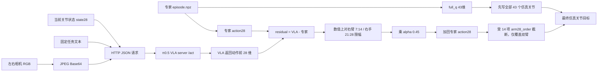
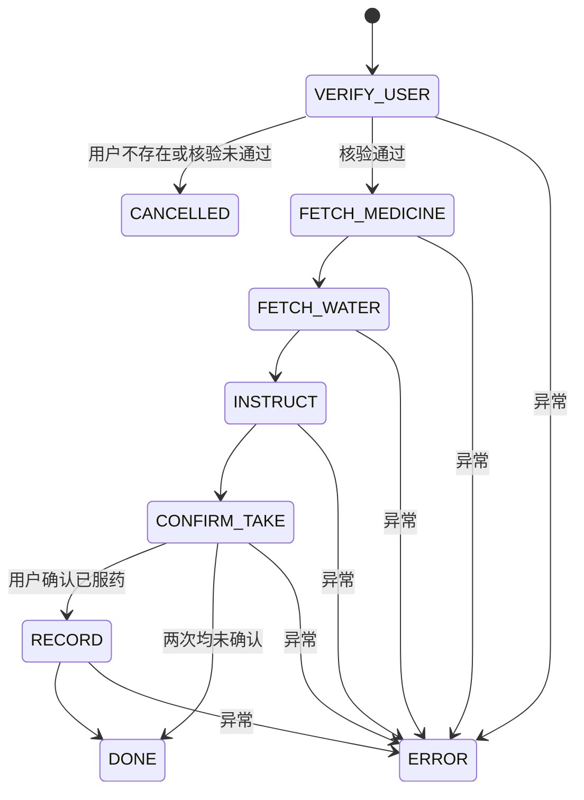
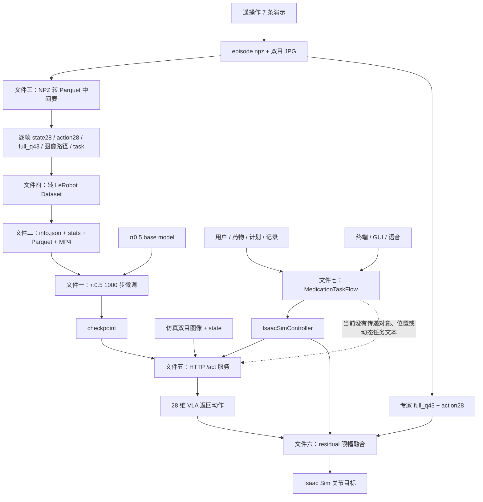

# 养老照护大赛 π0.5 VLA 微调项目接管指南

> 当前阶段：机器人尚未到货，硬件确定为宇树 G1 + Dex3-1 灵巧手。现阶段目标不是连接实机，而是借助学弟留下的仿真数据和代码，理解并复现 π0.5 VLA 模型微调链路，为后续迁移到真实机器人做准备。

## 环境准备状态（2026-07-12）

第一套 π0.5 微调环境已经完成安装和验证：

| 项目 | 当前结果 |
|---|---|
| Conda 环境 | `lerobot312` |
| Python | 3.12.13 |
| GPU | NVIDIA GeForce RTX 4070，12GB |
| NVIDIA 驱动 | 535.309.01 |
| PyTorch | 2.7.1+cu118 |
| torchvision | 0.22.1+cu118 |
| LeRobot | 0.5.2，本地 editable 安装 |
| Transformers | 5.5.4 |
| Datasets | 4.8.5 |
| PyArrow | 25.0.0 |
| PyAV | 15.1.0 |

已完成的实际验证：

- `nvidia-smi` 在宿主机正常。此前失败是 Codex 沙箱没有映射 `/dev/nvidia*`，不是驱动故障。
- `torch.cuda.is_available()` 返回 True。
- RTX 4070 支持 BF16，并已完成一次 BF16 GPU 矩阵计算。
- `pip check` 返回 `No broken requirements found`。
- π0.5 配置可从本地基础模型离线读取。
- PaliGemma tokenizer 可离线读取，词表大小为 257152。
- 最终 LeRobot 数据集曾在原生成版元数据下成功离线加载：7 条 episode、7195 帧。
- 曾实际解码一条训练样本：28 维 state、28 维 action、两路 `3x480x640` 图像和任务文本均正常。
- `lerobot.scripts.lerobot_train --help` 可正常启动，并识别 `policy.type=pi05`。

> [!success] 2026-07-12 当前复核
> 已从同一数据集的历史验收日志恢复转换器生成的纯 JSON，并补回随后记录的 `task` feature。标准库 JSON 解析、LeRobot 离线加载和实际样本解码均已重新通过。解释性内容保留在本笔记中，不再写入机器读取的生成合同。

激活方式：

```bash
conda activate lerobot312
export HF_HOME=/home/user/zhangxu/hf_cache
export HF_HUB_OFFLINE=1
export TRANSFORMERS_OFFLINE=1
export HF_DATASETS_OFFLINE=1
```

环境复现文件：

- `/home/user/zhangxu/environment/lerobot312.yml`
- `/home/user/zhangxu/environment/lerobot312-pip-freeze.txt`

当前系统没有安装 `ffmpeg` 命令，但 PyAV 已能正常解码现有训练视频，因此不阻断当前数据读取和模型微调。需要重新编码或批量处理视频时再安装系统 FFmpeg。

## 1. 先明确当前目标

当前应完成的闭环是：

```text
理解数据格式
  -> 能加载本地 LeRobot 数据集
  -> 能加载 π0.5 基础模型
  -> 能对固定样本执行推理
  -> 能完成 20 步 smoke 微调
  -> 能完成一次正式微调
  -> 能解释 checkpoint 如何进入仿真控制链路
```

当前不需要立即完成：

- 安装完整 Isaac Sim 和宇树 SDK。
- 控制真实 G1 或 Dex3 灵巧手。
- 直接修改最终控制脚本。
- 删除现有大模型、checkpoint 或缓存。
- 把仿真中的 `full_q` 专家轨迹直接发送给实机。

项目当前采用的并不是纯端到端 VLA 裸控，而是：

```text
专家轨迹 full_q 安全锚点
  + 微调后的 π0.5 动作预测
  + residual 限幅融合
```

最终仿真配置使用 `alpha=0.45`，只允许 VLA 修正右臂和右手，左侧及其他关节继续跟随专家轨迹。

## 2. 现在到底需要安装什么

必须把环境拆成三套。LeRobot、Isaac Lab、实机 SDK 的 Python 和底层依赖不同，强行装进一个环境会产生版本冲突。

### 2.1 第一套：现在必须准备的 π0.5 微调环境

建议环境名沿用原脚本：`lerobot312`。

| 项目           | 要求或建议                        | 证据                           |
| ------------ | ---------------------------- | ---------------------------- |
| 操作系统         | Ubuntu 22.04，当前已满足           | 当前机器为 Ubuntu 22.04.1         |
| Python       | 3.12                         | 本地 LeRobot 0.5.2 要求 `>=3.12` |
| GPU          | 支持 BF16 的 NVIDIA GPU         | 训练脚本使用 `cuda` 和 `bfloat16`   |
| 显存           | 原训练约占 12.85GB，建议至少 16GB      | 原 1000 步训练日志                 |
| 内存           | 建议至少 32GB                    | 当前机器为 31GiB                  |
| 磁盘           | 单次实验额外预留 30-50G；反复训练预留 100G  | 每个完整 checkpoint 约 11G        |
| LeRobot      | 使用项目内的 0.5.2 源码              | `lerobot/pyproject.toml`     |
| PyTorch      | `>=2.7,<2.12`                | LeRobot 依赖约束                 |
| Transformers | `>=5.4,<5.6`                 | LeRobot `pi` extra           |
| 数据组件         | datasets、pandas、pyarrow、PyAV | LeRobot `training` extra     |

本机已经按以下方式完成安装。以下命令仅用于未来重建环境：

```bash
conda create -n lerobot312 python=3.12 -y
conda activate lerobot312

cd /home/user/zhangxu
pip install torch==2.7.1 torchvision==0.22.1 \
  --index-url https://download.pytorch.org/whl/cu118
pip install -e './lerobot[pi,training]'
```

选择 cu118 是因为当前 NVIDIA 535 驱动能够稳定支持该运行时，同时满足 LeRobot 对 PyTorch `>=2.7` 的要求。不要自行改成 cu126，除非先核对并升级 NVIDIA 驱动。

本地已经存在，不需要重新下载：

- π0.5 基础模型：`/home/user/zhangxu/models/pi05_base`，约 14G。
- PaliGemma tokenizer：`/home/user/zhangxu/models/paligemma-3b-pt-224_tokenizer`。
- 最终 LeRobot 数据集：`/home/user/zhangxu/isaac_g1/demos/final_scene_vla_care_7demo_lerobot_filtered_stride2`，约 2.3G。
- 最终 1000 步微调 checkpoint。

当前 GPU 驱动实际正常。此前 Codex 沙箱内的 `nvidia-smi` 失败，是因为沙箱没有映射 `/dev/nvidia*`；在宿主机运行 `nvidia-smi` 已成功识别 RTX 4070、驱动 535.309.01。

以后出现 GPU 问题时先执行诊断，不要盲目重装 CUDA：

```bash
nvidia-smi
ubuntu-drivers devices
dkms status
uname -r
```

恢复后记录以下输出，作为环境真源：

```bash
nvidia-smi
nvcc --version
python -c "import torch; print(torch.__version__, torch.version.cuda, torch.cuda.get_device_name())"
```

### 2.2 第二套：以后复现仿真才需要的 Isaac Lab 环境

建议沿用原脚本环境名：`isaaclab45`。

项目证据指向：

- Python 3.10。
- Isaac Lab 2.1.0。
- Isaac Sim 4.5.0。
- 单独 Conda 环境，不与 `lerobot312` 混装。

这套环境体积大，当前只学习和复现模型微调时可以暂缓。需要重新运行场景、采集演示或验证 residual 闭环时再安装。

详细安装背景见：[[Unitree Isaac Lab 仿真平台安装与使用指南]]。

### 2.3 第三套：G1 + Dex3 到货后才需要的实机环境

等机器人到货、确认固件和计算平台后，再安装：

- 宇树官方 `unitree_sdk2` 或 `unitree_sdk2_python`。
- CycloneDDS 及对应网络配置。
- G1、Dex3 的当前固件/API 对应版本。
- 必要时安装 ROS 2，但 DDS 控制本身不等于必须先用 ROS 2。
- 实机相机驱动、标定工具和时间同步组件。

LeRobot 中虽然存在 `unitree_g1` extra，但 `unitree-sdk2` 依赖被注释掉了，说明当前仓库没有锁定可靠的实机 SDK 版本，不能现在随便安装一个最新版代替。

参考已有笔记：

- [[Unitree Dex3-1 灵巧手 DDS 通信接口文档]]
- [[Unitree Isaac Lab 仿真平台代码架构深度解析]]
- [[养老照护大赛-下午开会准备]]

## 3. 为什么环境装好后仍不能直接运行

当前项目是从另一台机器整体复制来的，至少存在三个迁移问题：

1. 脚本大量硬编码 `/data/zhangxu/...`，本机实际目录是 `/home/user/zhangxu/...`。
2. `lerobot312` 已经恢复并通过 GPU/依赖验证；`isaaclab45` 尚未恢复，但当前离线微调阶段不需要它。
3. 基础模型、tokenizer 和数据资产已经复制到本机，但离线运行仍要求路径、元数据和 checkpoint 自带的 pre/postprocessor 同时正确。

因此当前正确顺序是：恢复合法数据合同 -> 建立本机可复现入口 -> 全量数据审计 -> 验证现有 checkpoint -> 本人复现 20 步 smoke -> 建立独立验证协议 -> 再决定是否正式微调。不要先直接运行 1000 步脚本。

## 4. 剩余 7 个核心文件分别是什么

总介绍文件是：

`/home/user/zhangxu/success_final/README_FINAL.txt`

它告诉我们最终方案、模型路径、演示入口和答辩口径。下面 7 个文件则分别对应完整链路中的不同阶段。

### 4.1 文件一：1000 步微调启动脚本

路径：

`isaac_g1/outputs1/pi05_final_scene_train_scripts/run_pi05_final_scene_1000.sh`

它负责把数据、基础模型和训练参数交给 LeRobot：

```text
本地 LeRobot Dataset
  + π0.5 基础模型
  + 训练参数
  -> lerobot.scripts.lerobot_train
  -> checkpoints/000250、000500、000750、001000
```

重点参数：

| 参数 | 含义 |
|---|---|
| `dataset.root` | 本地训练数据集路径 |
| `policy.type pi05` | 使用 π0.5 策略 |
| `policy.pretrained_path` | 从基础模型开始微调 |
| `max_state_dim/max_action_dim=32` | 28 维数据补齐到模型支持的 32 维 |
| `chunk_size=50` | 一次预测未来 50 个动作 |
| `train_expert_only=true` | 只训练 action expert 和投影层 |
| `freeze_vision_encoder=true` | 冻结视觉编码器 |
| `gradient_checkpointing=true` | 用计算换显存 |
| `batch_size=1` | 降低显存占用 |
| `steps=1000` | 总训练步数 |
| `save_freq=250` | 每 250 步保存一次 |

阅读方法：先把所有命令行参数按“数据、模型、资源、训练、输出”五类标注。暂时不要纠结 Shell 语法，核心是理解每个参数如何改变训练行为。

完成标准：你能脱离文件解释“为什么冻结视觉编码器、为什么只训练 action expert、为什么 batch size 是 1”。

┌─────────────────────────────────────────────────────────────┐
│                    π0.5 VLM 主干（冻结）                    │
│  （视觉编码器冻结 + 语言模型冻结）                          │
│  输入：图像 + 文本指令 → 输出：高层语义特征                │
└─────────────────────────────────────────────────────────────┘
                              │
                              ▼
┌─────────────────────────────────────────────────────────────┐
│              动作专家（Action Expert，可训练）              │
│  ★ 只训练这个部分                                          │
│  输入：高层语义 + 状态（关节角度等）→ 输出：残差修正量     │
└─────────────────────────────────────────────────────────────┘
                              │
                              ▼
┌─────────────────────────────────────────────────────────────┐
│                最终动作 = 基础动作 + 残差修正量             │
│  （alpha 控制混合比例，MAX_RESIDUAL 做安全限幅）           │
│  输出：未来 50 步动作序列（chunk_size=50）                 │
└─────────────────────────────────────────────────────────────┘

### 4.2 文件二：最终数据集合同 `info.json`

路径：

`isaac_g1/demos/final_scene_vla_care_7demo_lerobot_filtered_stride2/meta/info.json`

它是训练数据的 schema，而不是普通日志。它说明数组结构和转换器声明的名称；名称是否对应真实数值列还必须回到原始 NPZ 验证。

- `observation.state`：28 维左右臂和左右手关节状态。
- `action`：28 维动作监督目标。
- 两路 `480x640` RGB 图像。
- `task`：自然语言任务指令。
- 7 条 episode、7,195 帧、15 FPS、一个任务。
- `robot_type=unitree_g1_dex3`。

28 维组成：

```text
左臂 7 + 右臂 7 + 左手 7 + 右手 7 = 28
```

阅读方法：先画出每个维度的关节顺序，再与原始 NPZ 的 `left_hand_names/right_hand_names` 逐列对账。2026-07-12 已确认当前手部名称与数值错位，不能继续把 `info.json.names` 当成物理真源。

完成标准：能回答“一帧训练样本中有哪些字段、每个字段是什么形状”，并能指出第 14-27 维当前只有数组分组意义，旧手部标签不可信。

风险：只有一个语言任务和 7 条同场景演示，不能用它证明模型具备跨物体、跨场景泛化能力。

### 4.3 文件三：原始 NPZ 转训练表

路径：

`isaac_g1/outputs1/convert_final_scene_7demo/convert_npz_7demo_to_training_table.py`

它负责读取遥操作录制结果：

- `episode.npz` 中的 `observation_state`、`action`、`full_q`。
- 每一帧对应的左右相机 JPG。
- 物体位姿字段。
- 人工写入的英文任务指令。

然后生成 Pandas/Parquet 中间表，并把 6 条标为 train、1 条标为 val。

几个概念要分清：

- `observation_state`：模型当前看到的 28 维关节状态。
- `action`：模仿学习监督的 28 维动作轨迹。
- `full_q`：43 维完整机器人关节状态，主要用于专家回放安全锚点，不直接作为 π0.5 输出。
- 图像路径：这一阶段仍引用原始 JPG，没有立刻重新编码视频。

阅读方法：从 `EPISODES` 列表开始，然后顺着 `np.load -> shape assert -> row -> parquet` 阅读。

完成标准：能解释“一条遥操作 episode 如何变成逐帧表格”，并知道 shape assert 为什么重要。
### ❓ 一条遥操作 episode 如何变成逐帧表格？

1. **录制阶段**：操作员在仿真/实机上操作 G1 机器人完成任务，系统自动记录：
    
    - 每帧的关节状态 (`observation_state`)
        
    - 每帧采取的动作 (`action`)
        
    - 完整状态备份 (`full_q`)
        
    - 左右摄像头图像 (JPG)
        
    - 物体位姿 (可选)
        
2. **转换阶段**：脚本执行以下操作：
    
    - `np.load()` 读取 `episode.npz` 中的所有 NumPy 数组
        
    - 循环遍历每一帧 `i`（从 0 到 N-1）
        
    - 从每个数组中取出第 `i` 行，组合成一个字典 `row`
        
    - 所有 `row` 汇总成 Pandas DataFrame
        
    - 导出为 Parquet 文件
        

### ❓ shape assert 为什么重要？

1. **契约检查**：训练脚本 π0.5 期望 `observation.state` 和 `action` 都是 28 维。如果录制时机械臂配置变了（如换了 6 指灵巧手），shape 会变成 30 维，assert 会立即失败，避免用错数据。
    
2. **数据完整性**：检查图像数量是否等于状态帧数，防止图像丢失导致训练时读到空数据。
    
3. **早期故障定位**：在转换阶段报错比在训练时报错更容易定位问题。如果训练到一半才发现数据形状不对，调试成本高得多。
    

### ❓ 为什么 `full_q` 是 43 维但不是模型输出？

|维度|内容|用途|
|---|---|---|
|28 维|双臂 (7+7) + 双手 (7+7)|π0.5 模型输入/输出（操作相关）|
|43 维|28 维 + 躯干倾斜 + 头部转动 + 腿部姿态等|仿真器完整回放（安全锚点）|

`full_q` 的 43 维包含了 G1 人形机器人全身状态，但 π0.5 只输出上肢控制指令。`full_q` 主要用于：

- **仿真回放安全锚点**：评估模型输出时，可以用 `full_q` 做参考
    
- **未来扩展**：如果以后要控制全身，可以直接启用更多维度


### 4.4 文件四：训练表转 LeRobot Dataset

路径：

`isaac_g1/outputs1/convert_final_scene_7demo_lerobot_filtered_v2/convert_final_scene_7demo_filtered_to_lerobot_v2.py`

这个文件把自定义 Parquet 中间表转换为 LeRobot v3 数据集。它完成：

1. 定义 observation/action/image feature。
2. 按动作变化检测有效运动区间。
3. 从 30 FPS 每隔一帧采样一次，得到 15 FPS。
4. 读取左右 JPG，交给 LeRobot 编码成视频数据集。
5. 为每帧写入任务语言。
6. 生成 `info.json`、`stats.json`、episode 元数据和过滤报告。

当前过滤结果从 14,383 帧降为 7,195 帧。由于前后 padding 较大，运动裁剪实际上没有删除多少首尾内容，主要压缩来自 stride=2。

阅读方法：重点读 `features`、`find_motion_window()`、`dataset.add_frame()`、`dataset.save_episode()`；兼容性异常处理可以后看。

完成标准：能解释“为什么训练脚本不能直接吃原始 NPZ，以及 LeRobot Dataset 多提供了哪些合同和统计信息”。
┌─────────────────────────────────────────────────────────────────────────────┐
│                    阶段 1: 遥操作原始录制（仿真器输出）                    │
│  /demos/final_scene_teleop_npz/episode_xxx/                              │
│  ├── episode.npz      (state, action, full_q, object_pose)               │
│  └── images/                                                             │
│      ├── cam_left_high/*.jpg   (每帧 1 张 JPG，30 FPS)                  │
│      └── cam_right_high/*.jpg                                            │
│  【问题】无法被 LeRobot 直接识别，图像散装，帧率不一致                   │
└─────────────────────────────────────────────────────────────────────────────┘
                                    │
                                    ▼ 【转换脚本 1: npz_to_parquet.py】
┌─────────────────────────────────────────────────────────────────────────────┐
│                    阶段 2: 自定义 Parquet 中间表                         │
│  /demos/final_scene_vla_care_7demo_table/                                │
│  └── data/all.parquet                                                    │
│      ├── index, episode_index, frame_index, timestamp, split             │
│      ├── task: "pick up..."                                              │
│      ├── observation.state: [28 float32]                                 │
│      ├── action: [28 float32]                                            │
│      ├── full_q: [43 float32]                                            │
│      ├── object_green_pos: [3 float32]                                   │
│      ├── object_cup_pos: [3 float32]                                     │
│      └── observation.images.cam_*_high: "路径/xxx.jpg" (字符串)          │
│  【优势】所有数据统一在表格中，方便查看和过滤                            │
│  【问题】图像仍为文件路径引用，不是编码视频；帧率仍为 30 FPS             │
└─────────────────────────────────────────────────────────────────────────────┘
                                    │
                                    ▼ 【转换脚本 2: parquet_to_lerobot.py】（本文）
┌─────────────────────────────────────────────────────────────────────────────┐
│                    阶段 3: LeRobot v3 标准数据集                          │
│  /demos/final_scene_vla_care_7demo_lerobot_filtered_stride2/             │
│  ├── meta/                                                               │
│  │   ├── info.json          (完整 schema + 统计信息)                    │
│  │   ├── stats.json         (每个特征的 mean/std)                       │
│  │   ├── episodes/          (每条 episode 的起止帧索引)                 │
│  │   └── filter_report.json (转换参数记录)                              │
│  ├── data/                                                              │
│  │   └── chunk-000/         (episode 索引文件)                          │
│  └── videos/                                                            │
│      ├── cam_left_high/     (左摄像头 MP4 视频，15 FPS)                 │
│      └── cam_right_high/    (右摄像头 MP4 视频，15 FPS)                 │
│  【优势】标准化格式，训练脚本可直接加载；视频压缩节省存储                │
└─────────────────────────────────────────────────────────────────────────────┘
                                    │
                                    ▼ 训练脚本直接使用
                         LeRobotDataset 统一加载接口
### ❓ 为什么训练脚本不能直接吃原始 NPZ？

|问题|原始 NPZ|中间表 Parquet|LeRobot Dataset|
|---|---|---|---|
|文件格式|私有 `.npz`|通用 Parquet|标准目录结构|
|图像存储|散装 JPG|文件路径字符串|MP4 视频编码|
|帧率|30 FPS|30 FPS|15 FPS（已降采样）|
|运动裁剪|❌ 无|❌ 无|✅ 已裁剪|
|特征名称|❌ 无|❌ 无|✅ 有（如 `kLeftShoulderPitch`）|
|统计信息|❌ 无|❌ 无|✅ mean/std|
|训练脚本兼容|❌ 需定制|❌ 需定制|✅ 标准 API|

### ❓ LeRobot Dataset 多提供了哪些合同和统计信息？

1. **info.json**：明确声明每个字段的 `dtype`、`shape`、`names`。训练脚本在加载时会校验数据是否匹配，防止维度错位。
    
2. **stats.json**：每个特征的 `mean` 和 `std`。训练时用这些值对 state 和 action 做归一化，让模型收敛更稳定。π0.5 训练脚本在 `policy.dtype=bfloat16` 下依赖这些统计值。
    
3. **Episode 索引**：记录了每条 episode 的起始帧和结束帧。训练时可以按 episode 读取，方便做 train/val 划分和序列采样。
    
4. **视频编码**：将散装 JPG 压缩为 H.264 MP4，存储空间从 200MB 降到约 50MB，同时支持随机帧访问（通过 keyframe 索引）。
    
5. **统一的 API**：`LeRobotDataset.load()` 一行代码即可加载，无需关心底层数据是如何存储的。
### ❓ 训练脚本如何使用这些信息？

python

from lerobot.datasets.lerobot_dataset import LeRobotDataset
# 加载数据集
dataset = LeRobotDataset(
    repo_id="zhangxu/final_scene_vla_care_7demo_filtered_stride2",
    root="/data/zhangxu/isaac_g1/demos/final_scene_vla_care_7demo_lerobot_filtered_stride2",
    video_backend="pyav",
)
# 自动获得：
# - dataset.meta.features: 字段定义（来自 info.json）
# - dataset.meta.stats: 归一化参数（来自 stats.json）
# - dataset.episodes: 每条轨迹的起止帧
# - dataset[num]: 返回第 num 帧的数据字典，包含 state、action、图像、task
# 训练时，框架会自动：
# - 用 stats 归一化 state 和 action
# - 从视频中解码对应帧的图像
# - 按 episode 组织数据，支持 chunk_size 采样


### 4.5 文件五：π0.5 HTTP 推理服务

路径：

`success_final/server/pi05_act_server_finalscene_1000.py`

它把 checkpoint 封装成一个本地 `/act` HTTP 接口：

```text
JSON 请求
  -> base64 解码左右图像
  -> 组装 observation.state、图像、task
  -> checkpoint preprocessor 归一化并生成语言 token
  -> PI05Policy.select_action()
  -> checkpoint postprocessor 反归一化
  -> 返回物理数值空间中的 28 维 action
```

为什么需要服务：Isaac Lab 使用 Python 3.10，当前 LeRobot 使用 Python 3.12。通过 HTTP 将两套环境拆开，可以避免在同一进程中混装冲突依赖。

阅读方法：按 `load_policy -> b64_jpeg_to_array -> Pi05Server.act -> Handler.do_POST -> main` 阅读。

当前实现已经改为 LeRobot 官方 preprocessor/policy/postprocessor 顺序，并用本地 tokenizer 路径覆盖 checkpoint 中的旧 `/data/zhangxu`。每次 HTTP 请求会清空 policy action queue，使用最新观测重新计算第一步动作；否则客户端每 15 个 replay frame 请求一次时，会以错误节奏消费模型内部缓存的 50 步 chunk。

完成标准：能自己写出一份请求 JSON 的字段清单，并说明返回动作如何归一化/反归一化。
┌─────────────────────────────────────────────────────────────────────────────┐
│                           【训练阶段】                                      │
├─────────────────────────────────────────────────────────────────────────────┤
│                                                                             │
│  1. 原始数据 (NPZ)                                                         │
│     action: [0.12, -0.34, 0.56, ...]   ← 物理空间（弧度）                  │
│                                                                             │
│  2. 计算统计量 (stats.json)                                                │
│     mean: [0.01, -0.02, 0.03, ...]                                         │
│     std:  [0.15, 0.12, 0.18, ...]                                          │
│                                                                             │
│  3. 归一化 (训练时)                                                        │
│     action_norm = (action - mean) / std                                    │
│     → [0.73, -2.67, 2.94, ...]   ← 归一化空间                             │
│                                                                             │
│  4. 模型学习预测归一化动作                                                  │
│     loss = mse(pred_norm, action_norm)                                     │
│                                                                             │
└─────────────────────────────────────────────────────────────────────────────┘
                                    │
                                    ▼
┌─────────────────────────────────────────────────────────────────────────────┐
│                           【推理阶段】                                      │
├─────────────────────────────────────────────────────────────────────────────┤
│                                                                             │
│  5. HTTP 服务端推理                                                         │
│     pred_norm = policy.select_action(batch)   ← 输出归一化动作             │
│     → [0.71, -2.60, 2.88, ...]                                             │
│                                                                             │
│  6. checkpoint postprocessor 反归一化                                      │
│     action_phys = postprocessor(pred_norm)                                 │
│     → [0.107, -0.314, 0.548, ...]   ← 数据集 action 数值空间              │
│                                                                             │
│  7. 服务端返回已后处理动作                                                  │
│     response["action"] = action_phys                                      │
│     response["action_space"] = "checkpoint_postprocessed"                │
│                                                                             │
│  8. residual 客户端只消费，不再重复反归一化                                │
│     robot.set_joint_targets(action_phys)                                   │
│                                                                             │
└─────────────────────────────────────────────────────────────────────────────┘
### 4.6 文件六：最终仿真 residual 控制脚本

路径：

`success_final/scripts/final_scene_real_g1dex3_v48_fullq_vla_residual_alpha045_armstrong_handsoft_v7.py`

这是最大的文件，但本轮不需要通读。定向检查以下五个逻辑区，已经可以闭合从观测到仿真关节目标的数据流。

#### 4.6.1 专家轨迹与 residual 参数

| 代码项                      |                                                                                                   当前值 | 控制含义                                     |
| ------------------------ | ----------------------------------------------------------------------------------------------------: | ---------------------------------------- |
| `V48_REPLAY_NPZ`         | `/data/zhangxu/isaac_g1/demos/final_scene_teleop_npz/episode_20260703_171539_00932frames/episode.npz` | 专家轨迹来源                                   |
| `V48_REPLAY_FULL_Q`      |                                                                                        NPZ 的 `full_q` | 每帧完整 43 维关节安全锚点                          |
| `V48_REPLAY_ACTION28`    |                                                                                        NPZ 的 `action` | 与 VLA 输出对齐的 28 维专家动作                     |
| `V48_REPLAY_ARM28_ORDER` |                                                                                   NPZ 的 `arm28_order` | 名称误导：文件中实际只有 14 个双臂关节名                    |
| `VLA_ALPHA`              |                                                                                                `0.45` | clipped residual 的融合权重                   |
| `VLA_QUERY_INTERVAL`     |                                                                                                  `15` | 每 15 个 replay frame 同步请求一次 VLA；其余帧复用最近结果 |
| `VLA_MAX_RESIDUAL_ARM`   |                                                                                                `0.12` | 右臂 residual 单维限幅                         |
| `VLA_MAX_RESIDUAL_HAND`  |                                                                                                `0.06` | 右手 residual 单维限幅                         |

虽然变量名叫“安全锚点”，这里没有独立的安全控制器。代码先回放完整 `full_q`，数值计算阶段确实给右臂和右手 residual 设置了限幅；但最终写回阶段受 14 项 `arm28_order` 截断，实际只有双臂会被覆盖，右手仍沿用 `full_q` 专家回放。

`alpha=0.45` 后，VLA 对单个关节目标的最大实际改变量为：

```text
右臂：0.45 * 0.12 = 0.054
右手：数值上计算 0.45 * 0.06 = 0.027，但当前没有写入仿真关节
其他 action28 维度：0
```

#### 4.6.2 `vla_query_action28()`：观测如何进入模型服务

函数先读取当前机器人状态，优先调用 `teleop.read_state28()`，失败时回退到 `teleop.read_state()`；随后从左右相机 annotator 取得 RGB 图像，并压成 quality 85 的 JPEG Base64。

发送到 `http://127.0.0.1:8788/act` 的 JSON 主要包含：

- `task`：固定英文任务描述。
- `state` 与 `observation.state`：同一份当前关节状态。
- `images.observation.images.cam_left_high`、`images.observation.images.cam_right_high`：嵌套形式的双目图像。
- `image_left`、`image_right`：兼容服务端读取方式的平铺双目图像。
- `frame`、`replay_idx`：当前仿真帧和专家轨迹索引。

HTTP 调用仍是同步的，超时设置为 90 秒。响应依次尝试读取 `action`、`actions`、`pred_action`、`result`；结果展平后只检查长度不少于 28，然后截取前 28 维写入 `VLA_LAST_ACTION28`。当前服务端已经调用 checkpoint postprocessor，并返回 `action_space=checkpoint_postprocessed`；客户端不应再次反归一化。尚未闭合的是 residual 客户端没有强制校验 `action_space`、有限值、动作时间戳和官方关节单位/方向。

#### 4.6.3 `apply_vla_residual_action28()`：专家与 VLA 如何融合

每个有效 replay frame 都会调用该函数，但只有当 `replay_idx % 15 == 0` 时才查询服务。融合基线不是当前仿真关节状态，而是同一 `replay_idx` 的专家 `action28`：

```text
replay_action = V48_REPLAY_ACTION28[replay_idx][:28]
vla_action = VLA_LAST_ACTION28[:28]

residual = vla_action - replay_action
```

随后构造 28 维限幅向量：

```text
lim[0:7]   = 0       # 左臂不允许 residual
lim[7:14]  = 0.12    # 右臂
lim[14:21] = 0       # 左手不允许 residual
lim[21:28] = 0.06    # 右手

residual_clip = clip(residual, -lim, +lim)
final_action = replay_action + 0.45 * residual_clip
```

数值数组中左臂和左手 residual 为 0，右臂和右手 residual 非零。可是 NPZ 的 `arm28_order` 只有 14 个双臂名称，`zip(V48_REPLAY_ARM28_ORDER[:28], final_action[:28])` 最多迭代 14 次。因此最终只有左右臂 14 维写回仿真；右手 21:28 的计算结果被丢弃。这是当前仿真链路的阻断缺陷，不是单纯文档命名问题。

#### 4.6.4 主循环中的覆盖顺序

主循环先计算 `replay_idx = frame - 60`，前 60 帧相当于 warmup。轨迹结束后，因为 `V48_REPLAY_HOLD_LAST=True`，会持续使用最后一帧。

每个 replay frame 的实际写入顺序是：

1. 读取 `full_q[replay_idx]`，按 `dof_names` 写入全部 43 个关节目标。
2. 调用 `apply_vla_residual_action28(frame, replay_idx)`。
3. residual 函数实际只覆盖 `arm28_order` 中的 14 个双臂关节。
4. 双手和其他关节继续保持该帧 `full_q` 目标。

所以最终送入仿真的并不是单独一份 28 维动作，而是“43 维专家回放打底 + 仅 14 个双臂关节可能被融合结果覆盖”。

#### 4.6.5 完整数据流



等价的控制合同是：

```text
相机/当前状态/任务
  -> 同步 HTTP VLA 查询
  -> 28维 VLA 动作
  -> 与同帧专家 action28 求 residual
  -> 数值上放行右臂和右手的限幅 residual
  -> 乘 alpha 后加回专家动作
  -> 当前实际仅覆盖 full_q 回放中的双臂关节，右手 residual 丢失
```

#### 4.6.6 实机迁移阻断项

动作尺度中的“漏调用 postprocessor”已在 2026-07-12 修复并通过真实样本 smoke；当前合同仍不能直接迁移到真实机器人：

- **手部数据标签已经确认错位**：原始 NPZ 每只手是 `index0,middle0,thumb0,index1,middle1,thumb1,thumb2`，转换器未重排却写入另一套 `info.json` 名称；当前 checkpoint 的手部输出不能直接按 Dex3 DDS 名称解释。
- **官方物理合同仍未闭合**：前 14 维双臂名称与 G1 LowCmd ID 15-28 已对上，Dex3 `q` 单位也确认是 rad；但逐关节实机正方向、零位和限位仍无证据。
- **右手 residual 没有写入仿真**：`arm28_order` 实际长度为 14，最终 `zip` 截断到双臂；现有仿真演示不能证明 VLA 控制了 Dex3。
- `urlopen(..., timeout=90)` 位于仿真主循环内，是同步阻塞调用。服务卡住时，场景更新和控制循环最多可停 90 秒。
- 查询失败只增加 `VLA_FAIL_COUNT` 并返回 `None`，不会清空 `VLA_LAST_ACTION28`。
- `apply_vla_residual_action28()` 不检查本次查询返回值，而是继续读取全局 `VLA_LAST_ACTION28`。一旦成功过一次，后续连续失败期间都可能无限复用旧动作。
- 缓存动作没有时间戳、最大年龄、连续失败降级或 watchdog；`VLA_QUERY_INTERVAL=15` 只能控制正常查询频率，不能限制陈旧动作寿命。
- 服务响应只校验维数不少于 28，没有校验 NaN/Inf；非有限值可能穿过 residual 计算并进入关节目标。

因此，“HTTP 失败时继续沿专家轨迹运行”仍只是表面意图，当前代码实际可能是“专家轨迹 + 陈旧 VLA residual”。在实机接入前，必须让 residual 客户端强制校验动作空间、有限值和官方关节合同，再把推理移出实时控制循环，并建立动作时间戳/TTL、失败即失效、连续失败降级和控制 watchdog；这些属于实机控制合同，不应靠继续调小 `alpha` 代替。

### 4.7 文件七：养老服药业务入口

路径：

`medication_robot/main.py`

它不是模型训练代码，而是产品业务装配入口。它负责读取 `config.yaml`，创建数据服务、交互界面和机器人 adapter，再把这些依赖交给 `MedicationTaskFlow`。

#### 4.7.1 入口模式与依赖装配

| 启动方式 | 交互层 | 机器人层 | 业务触发方式 |
|---|---|---|---|
| `python main.py` | 终端文字 | `SimulatedRobotController` | 立即执行一次 |
| `python main.py --gui` | PySide6 GUI | `SimulatedRobotController` | GUI 后台线程执行一次 |
| `python main.py --sim` | 终端文字 | `IsaacSimController` | 立即执行一次 |
| `python main.py --gui --sim` | PySide6 GUI | `IsaacSimController` | GUI 后台线程执行一次 |
| `python main.py --scheduler` | 配置决定 | 配置决定 | 每分钟检查计划时间 |
| `--voice` | Qwen3-ASR 语音交互 | 不改变机器人选择 | 与上述模式组合 |

`main.py` 自己不决定“该吃什么药”或“关节该转多少”。它只装配以下 owner：

- `MedicationService`：用户档案、药物、计划和库存真源。
- `RecordService`：服药记录与紧急呼叫记录，写 SQLite 并额外保存 JSON。
- `InteractionInterface` 实现：文字、GUI 或语音交互。
- `MedicationTaskFlow`：养老服药业务状态机。
- robot adapter：模拟控制器或 Isaac Sim 控制器。

#### 4.7.2 真实业务状态机



各阶段的 owner 很明确：

1. `VERIFY_USER`：查询用户、今日计划、今日记录、漏服和低库存，并要求用户确认。
2. `FETCH_MEDICINE`：选择当前最近的服药计划，检查库存，调用 `robot.grasp_object()` 和 `place_object()`。
3. `FETCH_WATER`：调用相同机器人能力取水杯。
4. `INSTRUCT`：播报药物特殊服用说明。
5. `CONFIRM_TAKE`：最多询问两次是否已经服药。
6. `RECORD`：检测一小时内重复服药、保存记录、扣减库存。
7. 任一步抛异常进入 `ERROR`；身份核验失败进入 `CANCELLED`。

紧急呼叫不在这条主状态机内。GUI 按钮或常驻语音检测会直接调用 `RecordService.save_emergency_call()`，形成独立旁路。

#### 4.7.3 业务层期望的机器人合同

`RobotController` 把业务层需要的能力压缩成四个命令：

```text
grasp_object(object_name) -> bool
place_object(position) -> bool
get_joint_state() -> ndarray
reset() -> None
```

这层设计的正确方向是：`MedicationTaskFlow` 只说“抓药盒、放到位置、抓水杯”，不关心 π0.5、HTTP、Isaac Sim、DDS 或关节名称。未来真实 G1 adapter 也应实现同一能力合同，而不是让业务状态机直接拼关节动作。

#### 4.7.4 当前 Isaac Sim adapter 实际做了什么

当前实现还没有达到上述逐命令合同：

```text
main.py --sim
  -> build_robot()
  -> IsaacSimController.start()
       -> 启动 π0.5 HTTP server
  -> MedicationTaskFlow.run()
  -> 第一次 grasp_object("medicine_box")
       -> 启动并等待整个固定 residual demo
       -> demo 内部一次完成“药盒 -> 托盘 -> 水杯”固定轨迹
  -> place_object(...) 返回 True，不下发新动作
  -> 第二次 grasp_object("water_cup") 返回 True，不下发新动作
  -> 第二次 place_object(...) 返回 True，不下发新动作
```

也就是说，业务状态机中的四个机器人命令并没有分别驱动四个物理阶段。第一次抓药调用承载了整个固定仿真演示，之后的命令只是日志和成功占位。

#### 4.7.5 当前集成断点

- `build_robot()` 创建 `IsaacSimController` 后立即同步调用 `start()`，因此 π0.5 服务在身份核验之前就启动；状态机核验成功后又调用一次 `start()`，第二次只是因为进程已存在而返回。
- `IsaacSimController._run_demo()` 虽然检查配置中的 `demo_script`，真正启动时却使用硬编码 Python 脚本路径，没有执行配置给出的 `run_final_demo.sh`。
- demo 超时或非零退出只记日志，不抛异常；`grasp_object()` 随后仍返回 `True`，业务层会把失败当成功继续记录。
- `capture_frame()`、`get_joint_state()` 和 `get_sim_time()` 返回固定零值，不是真实仿真观测。
- `DiffusionPolicyController` 是未接线的旧占位实现，所有方法均抛 `NotImplementedError`，`build_robot()` 也不会选择它。
- 业务传入的 `medicine_box`、`water_cup` 和放置位置没有传到 VLA 服务。真正的 VLA 任务文本仍硬编码在最终仿真脚本中。
- 当前只有 `simulated` 与 `isaac_sim` 两种选择，没有真实 G1 + Dex3 adapter。

因此当前三层是“代码目录上分开，运行合同上尚未完全接通”：

```text
业务状态机            robot adapter                 VLA / 仿真控制
MedicationTaskFlow -> IsaacSimController -> 启动固定 server + 固定 demo
     传对象命令             未逐命令映射              使用脚本内硬编码任务
```

完成标准已经达到：可以明确区分业务状态机、机器人 adapter、VLA policy 三层；同时必须知道当前 adapter 只是进程启动桥，不是可按业务命令控制的机器人能力实现。

## 5. 七个文件串起来后的项目全流程

### 5.1 项目的真实主线

这七个文件不是同一个程序的七个连续函数，而是三个阶段的真源：

```text
阶段 A：演示数据工程
遥操作录制 -> NPZ/JPG -> Parquet 中间表 -> LeRobot Dataset

阶段 B：VLA 训练与仿真验证
LeRobot Dataset -> π0.5 微调 -> checkpoint -> HTTP server
-> residual 融合 -> Isaac Sim 关节目标

阶段 C：养老业务外壳
用户/药物/计划/交互 -> MedicationTaskFlow
-> robot adapter -> 当前仅启动阶段 B 的固定演示
```

项目当前最准确的定位不是“已经完成的养老机器人”，而是：

> 一个单场景 π0.5 模仿学习与 residual 仿真验证原型，外加一个养老服药业务状态机原型；两者已经通过进程启动方式拼接，但尚未形成按业务命令驱动的真实机器人闭环。

### 5.2 从数据到业务的完整数据流



最后一条虚线是当前项目最重要的边界：业务层能启动 VLA 仿真，但没有把“当前用户该取哪种药、抓哪个对象、放到哪里”变成模型或控制层可消费的结构化命令。

### 5.3 七个文件分别承担什么合同

| 文件              | 输入                        | 输出                             | 谁调用它          | 失败影响               | 它真正想表达的意思                     |
| --------------- | ------------------------- | ------------------------------ | ------------- | ------------------ | ----------------------------- |
| 文件一：1000 步训练脚本  | LeRobot Dataset、基础模型、训练配置 | checkpoint、日志                  | 人工运行 Shell    | 没有可用于推理的微调模型       | 小数据下冻结通用视觉/VLM，只适配动作专家        |
| 文件二：`info.json` | 转换器生成的数据集元信息              | 28 维字段、图像、FPS、episode 等 schema | LeRobot 数据加载器 | 数据集无法加载或维度错位       | 结构合同；手部物理名称已确认错位，不能单独作为实机合同 |
| 文件三：NPZ 转表      | 原始 `episode.npz`、双目 JPG   | 自定义 Parquet 中间表                | 数据准备人员        | 原始演示不能进入后续标准化流程    | 把一次遥操作拆成可检查的逐帧监督样本            |
| 文件四：表转 LeRobot  | 中间表和 JPG                  | LeRobot v3 数据集、视频、统计量、过滤报告     | 数据准备人员        | 训练脚本缺少标准数据接口与统计量   | 把私有录制格式变成框架可消费的数据产品           |
| 文件五：HTTP 服务     | checkpoint、状态、双目图像、任务文本   | JSON 形式的 28 维动作                | residual 仿真脚本 | 仿真拿不到新动作           | 隔离 Python 3.12 模型环境与 Isaac 环境 |
| 文件六：residual 控制 | 专家轨迹、仿真观测、VLA 动作          | 仿真关节目标                         | Isaac Sim 主循环 | 动作停滞、陈旧或尺度错误       | 用专家轨迹兜底，只让 VLA 做受限修正          |
| 文件七：业务入口        | 用户、药物计划、交互输入、配置           | 业务状态、服药记录、机器人能力调用              | 终端/GUI/调度器    | 流程取消、ERROR，或错误记录成功 | 养老业务应编排机器人能力，而不拥有关节语义         |

`configuration_pi05.py` 不是这七个项目文件之一，但它是解释文件一和文件二的框架真源：`max_state_dim/max_action_dim`、`chunk_size`、`n_action_steps` 和归一化模式必须以当前 LeRobot 实现为准，不能只相信训练脚本注释。

### 5.4 三层 owner 边界

#### 业务状态机层

Owner：`MedicationTaskFlow`、`MedicationService`、`RecordService`。

负责用户身份、药物计划、库存、漏服、重复服药、确认和记录。它只能调用“抓取、放置、复位”等能力，不应出现关节索引、HTTP payload、模型 checkpoint 或 residual 参数。

#### 机器人 adapter 层

Owner：`RobotController` 合同及其模拟、Isaac Sim、未来真实 G1 实现。

负责把业务能力翻译为具体控制过程，并返回真实成功/失败。它必须拥有超时、取消、进度、错误原因和结果验证，不能在 demo 失败后固定返回成功。

#### VLA policy 与控制层

Owner：LeRobot 数据合同、训练配置、pre/postprocessor、HTTP 推理服务和 residual 控制器。

负责把图像、状态和任务转成同一物理动作空间中的输出，再经过限幅、安全门和机器人接口执行。它不应查询老人数据库，也不应决定是否扣库存或生成服药记录。

### 5.5 当前源码审计发现的阻断问题

#### 已解决的本机微调阻断

1. **数据合同已恢复**：`meta/info.json` 已恢复为纯 JSON，标准库解析、LeRobot 离线加载和样本解码均通过。
2. **本机 smoke 入口已建立**：新增 `run_pi05_final_scene_smoke20_local.sh`，使用本机根路径和 Bash 参数数组，消除了旧脚本的 `/data/zhangxu` 与续行注释问题；旧脚本保留为历史证据。
3. **HTTP 动作尺度已修复**：服务端已接入 checkpoint pre/postprocessor、最新观测重算、28 维有限值检查和串行推理锁；真实 LeRobot 样本 smoke 返回 `checkpoint_postprocessed`。

#### 尚未解决的后续阻断

1. **residual 安全与官方关节合同未闭合**：客户端仍未强制检查 `action_space`、NaN/Inf、TTL 和 G1/Dex3 官方单位/方向。
2. **Isaac adapter 报告假成功**：整个固定 demo 只在第一次抓取时运行；非零退出和超时不会传播，后续业务命令固定返回成功。
3. **没有真实机器人执行层**：当前不存在 G1 + Dex3 SDK adapter、权限/急停/watchdog、状态反馈和动作结果验证。

#### 设计风险

- HTTP 在仿真循环内最多同步阻塞 90 秒，失败后可无限复用旧动作。
- 数据只有 7 条同场景 episode 和一个固定任务，不能证明跨药盒、跨位置或真实环境泛化。
- 数据、训练、服务、仿真和业务配置大量硬编码 `/data/zhangxu`、Conda 路径和脚本路径，当前机器可运行不等于可复现部署。
- 业务任务文本没有进入 VLA；模型执行的是脚本内固定英文指令，不是数据库计划生成的动态任务。

#### 可记录债务

- `DiffusionPolicyController` 是未使用的旧路线，占位注释与当前 π0.5 主线不一致。
- 模拟控制器和 Isaac 控制器返回的关节状态是 14 维或固定零值，与训练数据的 28 维合同不一致，但当前业务状态机没有消费它们。
- GUI 目录存在多个备份/复件文件，需要后续确认唯一 owner，但不阻断本轮理解主流程。

### 5.6 文件共同传达的设计思想

这组文件真正传达的不是“一个模型包办养老机器人”，而是以下分工：

1. **数据合同必须从采集真源生成并对账**：28 维关节顺序、图像键和任务文本应在数据合同中固定；本项目恰好证明手写标签而不重排数值会制造错误语义。
2. **训练只负责学习动作分布**：π0.5 不负责老人身份、用药时间、库存或服药确认。
3. **推理服务是环境隔离边界**：HTTP 的价值是拆开不兼容的 Python/Isaac 环境，不应成为无界阻塞和动作缓存的安全 owner。
4. **residual 是仿真验证策略，不是天然安全证明**：专家回放、限幅和小 `alpha` 能减小偏移，但不能修复尺度错误、陈旧动作或真实机器人故障。
5. **业务层应该调用能力，不应该调用关节**：`MedicationTaskFlow` 的方向正确；缺的是一个真正逐命令执行、可验证结果的 adapter。
6. **当前整合是进程级，不是语义级**：业务入口能启动 server 和 demo，但还不能把数据库中的具体服药任务转成 VLA/机器人命令。

### 5.7 推荐学习与修复顺序

理解顺序：

1. `info.json` 与 `configuration_pi05.py`：先理解 28 维数据和归一化合同。
2. NPZ 转表脚本：理解原始演示如何变成逐帧监督样本。
3. 表转 LeRobot Dataset：理解统计量、视频和 episode 元数据从哪里来。
4. 训练脚本：理解哪些权重在训练、输出什么 checkpoint。
5. HTTP 服务：确认 preprocessor/postprocessor 和返回动作空间。
6. residual 脚本：确认专家、VLA 和最终关节目标如何融合。
7. `MedicationTaskFlow` 与 robot adapter：确认业务命令如何进入控制层。

修复与验收顺序：

1. [已完成] 恢复机器可解析的生成版 `info.json`，把解释性注释放回文档而不是生成合同。
2. [入口已完成，训练待执行] 使用本机 smoke 脚本先跑 20 步，再验证 checkpoint 可重载。
3. 使用 checkpoint 对应的 pre/postprocessor 做固定样本推理，证明服务输出与专家动作同空间。
4. 给 residual 增加动作 TTL、失败失效、有限值校验和非阻塞推理边界。
5. 把 `IsaacSimController` 改成逐命令 adapter，并让 demo 退出码、超时和抓取结果真实传播。
6. 最后实现真实 G1 + Dex3 adapter；在这之前，不应把仿真成功描述为实机控制能力。

以后每读一个文件，仍然回答四个问题，但要增加第五个：

- 它的输入是什么？
- 它的输出是什么？
- 谁调用它？
- 它失败会导致什么？
- 它输出的语义、尺度和成功状态由谁验证？


## 6. 机器人未到时的执行计划

### 6.0 阶段产物统一阅读规则

从 2026-07-12 起，每个阶段输出目录都应能脱离聊天记录独立阅读：

1. 根目录提供中文 `README.md`，先写目的、阅读顺序、关键结论、不能推出的结论和复现入口。
2. JSON、CSV、JPG、日志和 checkpoint 分别提供中文解读，不要求读者直接从机器文件猜字段含义。
3. 原始机器产物保持不改；中文解读引用真实路径、字段和本轮验证结果。
4. 失败日志必须保留并解释，不能只留下最终成功结果。

阶段中文入口：

- 阶段 A：`/home/user/zhangxu/isaac_g1/outputs1/stage_a_reproducibility/README.md`
- 阶段 B：`/home/user/zhangxu/isaac_g1/outputs1/audit_final_scene_dataset/README.md`
- 阶段 C：`/home/user/zhangxu/isaac_g1/outputs1/eval_pi05_final_scene_fixed_samples/README.md`
- 阶段 D：`/home/user/zhangxu/isaac_g1/outputs1/pi05_final_scene_7demo_smoke20_local_sgd_20260712_165336/README.md`

### 6.1 状态口径：项目资产不等于本人已复现

后续清单必须分成两种状态，避免把“文件存在”误写成“当前机器已复现”：

| 状态 | 含义 |
|---|---|
| 项目已有资产 | 学弟留下了脚本、日志、数据或 checkpoint，只证明历史上产生过该结果 |
| 本人复现通过 | 在当前机器、当前路径和当前环境中重新运行，并保存了可检查的命令、日志和输出 |

当前已有但尚未由本人闭环验收的资产：

- 20 步 smoke checkpoint：`.../pi05_final_scene_7demo_smoke20_v5_20260703_194443/checkpoints/000020`，约 11G。
- 正式训练 checkpoint：`000250`、`000500`、`000750`、`001000`，所在实验目录约 44G。
- 每个完整 checkpoint 中包含模型、preprocessor、postprocessor 和训练状态。

这些资产应该先评估和重载，不应立即重复占用磁盘重新训练。

### 阶段 A：恢复本机可复现入口

- [x] 确认 NVIDIA 驱动正常；沙箱报错不代表宿主机驱动故障。
- [x] 创建 Python 3.12 的 `lerobot312`。
- [x] 安装并验证本地 `lerobot[pi,training]`。
- [x] 保存本机 Conda 导出和 pip freeze。
- [x] 从数据转换真源恢复机器可解析的纯 JSON `meta/info.json`；禁止在生成合同中保留 `//` 注释。 ✅ 2026-07-12
- [x] 重新验证 `info.json`、episode/task 元数据、Parquet 和视频路径属于同一版数据集。 ✅ 2026-07-12
- [x] 建立本机训练入口，消除 `/data/zhangxu` 硬编码和 Shell 续行中的独立注释。 ✅ 2026-07-12
- [x] 固定基础模型、tokenizer、数据集和输出目录，并在启动时打印这些真源路径。 ✅ 2026-07-12

停止条件：本机能够离线加载数据集和 π0.5 配置；训练命令通过语法/参数检查，但尚不启动正式训练。

### 阶段 B：全量数据质量审计，不训练

- [x] 打印并记录 7 条 episode、7195 帧、FPS 和两路 camera keys。 ✅ 2026-07-12
- [x] 检查全部帧的 state/action shape 都是 28，且没有 NaN/Inf。 ✅ 2026-07-12
- [x] 检查 episode、frame、timestamp、task 和图像载荷是否对齐。 ✅ 2026-07-12
- [x] 可视化每条 episode 的首帧、中间帧和末帧左右相机图像。 ✅ 2026-07-12
- [x] 生成按索引统计的 28 维 state/action 静态/运动覆盖表。 ✅ 2026-07-12
- [x] 核对官方材料与原始 NPZ，确认前 14 维双臂对应 G1 ID 15-28，并发现后 14 维手部标签与真实数值顺序不一致。不是“完全一致”。 ✅ 2026-07-12
- [ ] 修复手部 `source order -> canonical dataset order -> Dex3 DDS order` 映射，重新生成数据集、stats、processor 和受影响 checkpoint。
- [ ] 真机到货后逐关节低速验证正方向、零位和限位；现有材料只能确认 Dex3 位置命令单位为 rad。
- [x] 记录 state/action 各维最小值、最大值、均值和标准差，识别异常跳变或几乎不变化的维度。 ✅ 2026-07-12
- [x] 确认原始目录现有 8 个 NPZ，转换脚本只选择 7 个；额外的 `episode_20260703_171539_00932frames` 未进入训练数据。 ✅ 2026-07-12
- [ ] 明确 7 条训练演示和额外 1 条轨迹是否成功，以及额外轨迹是否由已有轨迹/脚本派生、能否作为独立评估数据。

停止条件：全量审计报告能够证明图像、状态、动作和任务文本按 episode 正确对齐；任何异常都能定位到具体 episode/frame。

#### 2026-07-12 阶段 B 执行记录

审计工具与产物：

- 脚本：`/home/user/zhangxu/isaac_g1/outputs1/audit_final_scene_dataset/audit_final_scene_dataset.py`
- 摘要：`/home/user/zhangxu/isaac_g1/outputs1/audit_final_scene_dataset/README.md`
- 机器报告：`/home/user/zhangxu/isaac_g1/outputs1/audit_final_scene_dataset/audit_report.json`
- 21 个固定样本联系表：`/home/user/zhangxu/isaac_g1/outputs1/audit_final_scene_dataset/contact_sheet.jpg`
- JSON 解读：`audit_report-json解读.md`
- JPG 解读：`contact_sheet-jpg解读.md`
- 关节合同：`28维关节合同核查.md`

实际结果：`PASS`，7 条 episode、7195 帧、15 FPS、0 个结构/有限值/索引/图像载荷错误。各 episode 长度为 `1135、1067、736、965、1317、985、990`，时间戳中位步长约 `0.066666` 秒。

需要保留的三个数据警告：

1. 同一存储帧的 `observation.state` 与 `action` 完全相同。π0.5 仍可通过未来 action chunk 学习后续轨迹，但不能把单帧 action 理解为相对当前 state 的 residual。
2. 静态维度为 `0-6、11、13、14-20`：左臂 7 维、左手 7 维以及右腕 roll/yaw 在全部 7195 帧中没有变化。
3. 21 个首/中/尾固定样本从画面上呈现一致的任务阶段，但数据没有独立成功标签，也未证明不存在未复制或被筛除的失败演示；因此“7 条全部成功”仍需学弟的采集记录或完整回放确认。

新增阻断发现：7 个原始 NPZ 的左右手实际数组顺序均为 `index0,middle0,thumb0,index1,middle1,thumb1,thumb2`；转换器只做 shape 检查和原样复制，却将其硬编码标为另一套 `ACTION_NAMES`。官方 Dex3 DDS 顺序为 `thumb0,thumb1,thumb2,middle0,middle1,index0,index1`，所需局部重排是 `[2,5,6,1,4,0,3]`。当前 `use_relative_actions=false`，PI05 按索引消费数值，关节名不进入 loss；因此可以保留源列顺序、修正名称并在 adapter 显式重排后重新评估旧 checkpoint。只有改变训练列顺序时才必须重训或增加等价置换层。

原始目录还存在未被 7-demo 转换脚本选中的 `episode_20260703_171539_00932frames`。当前 residual 脚本把它作为专家回放来源，因此它不是自动成立的独立验证集；需要向学弟确认采集/生成过程、成功状态以及是否与前 7 条存在轨迹派生关系。

### 阶段 C：先验证现有 checkpoint 的固定样本推理

- [x] 固定一组可复现的样本索引，覆盖 7 条 episode 的首帧、中间帧和末帧，共 21 个样本。 ✅ 2026-07-12
- [x] 依次加载 base、smoke `000020`、`000250`、`000500`、`000750`、`001000`。 ✅ 2026-07-12
- [x] 每个微调 checkpoint 加载自己保存的 preprocessor 和 postprocessor；base 使用同一数据集 stats 构造归一化覆盖。 ✅ 2026-07-12
- [x] 检查 postprocessor 后输出为有限的 28 维动作，并确认 raw 与物理动作存在实质差异。 ✅ 2026-07-12
- [x] 确认前 14 维双臂 ID 和 Dex3 `q` 的 rad 单位；同时确认手部标签错位，现有输出不能按当前名称直接下发。 ✅ 2026-07-12
- [ ] 在修复数据映射并重新训练后，重新评估正确语义下的四组动作误差。
- [x] 比较 base 与各 checkpoint 的动作差异，并分开记录左臂、右臂、左手、右手误差。 ✅ 2026-07-12
- [x] 记录单次推理延迟、GPU 峰值显存和固定种子重复运行的一致性。 ✅ 2026-07-12
- [x] 验证服务动作合同返回 `checkpoint_postprocessed`，而不是未经 postprocessor 的归一化值。 ✅ 2026-07-12

停止条件：同一固定样本能够离线重复推理，输出与专家 action 处于同一物理空间；checkpoint 不因“文件存在”而默认判定可用。

> [!important]
> 这一步是当前最高优先级的模型验证。动作空间未闭合时，减小 residual `alpha` 只能限制错误数值，不能修复单位或归一化错误。

#### 2026-07-12 阶段 C 离线执行记录

评估工具与产物：

- 脚本：`/home/user/zhangxu/isaac_g1/outputs1/eval_pi05_final_scene_fixed_samples/eval_fixed_samples.py`
- 说明：`/home/user/zhangxu/isaac_g1/outputs1/eval_pi05_final_scene_fixed_samples/README.md`
- 汇总：`summary.csv`、`summary.json`
- 每模型逐样本结果：`<model>_samples.json`
- 完整日志：`eval_all.log`
- JSON/CSV 解读：`summary-json与csv解读.md`、`逐样本-json解读.md`
- 日志与 HTTP 解读：`日志解读.md`、`HTTP服务smoke解读.md`

所有模型权重均报告 `All keys loaded successfully!`，6 个模型全部完成 21 个固定样本推理，固定随机种子重复运行的最大绝对差均为 `0.0`。模型驻留显存约 `8.73GB`，推理峰值约 `8.84GB`，平均单次推理约 `211-215ms`。

加载时仍会出现 `Vision embedding key might need handling` warning。当前 LeRobot 实现对任何包含 `patch_embedding` 的键都会无条件打印该提示，随后仍把键加入 state dict；本轮没有 missing/unexpected keys。现阶段记为非阻断的框架诊断债务，正式升级 LeRobot 或更换基础权重时必须重新核对，不能只隐藏 warning。

| 模型 | 21 样本平均 MAE | 相对 base 改善 | 右臂 MAE | 索引 21:28 MAE（旧标签“右手”） |
|---|---:|---:|---:|---:|
| base | 0.159774 | 0.00% | 0.234832 | 0.404265 |
| smoke20 | 0.156665 | 1.95% | 0.228954 | 0.397707 |
| 000250 | 0.066711 | 58.25% | 0.120339 | 0.146505 |
| 000500 | 0.057370 | 64.09% | 0.108514 | 0.120967 |
| 000750 | 0.043246 | 72.93% | 0.100851 | 0.072135 |
| 001000 | 0.037755 | 76.37% | 0.093707 | 0.057312 |

这些指标只能说明模型在训练过的 7 条 episode 固定帧上按索引拟合逐步改善，不能证明 `001000` 在新位置、新光照或新物体上泛化最好。表中的“右手 MAE”实际是索引 21:28 的分组指标，当前不能按错误标签解释为具体 Dex3 关节。每个模型仍有部分维度越出数据集观测 min/max；进入仿真前必须保留关节限位和 residual 安全门。

postprocessor 对 raw 归一化动作的平均单样本最大改变量约为 `1.17-1.39`，不是空操作。HTTP 服务已改为调用 checkpoint pre/postprocessor，并用真实数据集第 0 帧完成 smoke：权重全部键加载成功，返回 `checkpoint_postprocessed`、28 维有限动作，raw 范围约 `[-1.10, 0.82]`，后处理范围约 `[-0.070, 0.153]`，NaN state 被拒绝。日志位于 `eval_pi05_final_scene_fixed_samples/http_server_smoke.log`。

### 阶段 D：本人复现 20 步 smoke 微调

- [x] 使用新的时间戳输出目录，未覆盖学弟留下的 smoke 和正式 checkpoint。 ✅ 2026-07-12
- [x] 在启动前确认约 1.3TB 磁盘余量和 GPU 初始状态。 ✅ 2026-07-12
- [x] 使用 `batch_size=1`、BF16、gradient checkpointing 和低显存 SGD 完成 20 步训练链路 smoke。 ✅ 2026-07-12
- [x] 记录 20 步 loss、梯度、训练耗时和 GPU 峰值显存。 ✅ 2026-07-12
- [x] 验证 checkpoint 包含模型、preprocessor、postprocessor 和训练状态。 ✅ 2026-07-12
- [x] 退出训练进程后，在新进程重载新 `000020` 并完成 21 个固定样本推理。 ✅ 2026-07-12

停止条件：不是只看到训练进程结束，而是本人生成的新 checkpoint 能在新进程中重载，并输出同物理空间的合法 28 维动作。

#### 2026-07-12 阶段 D 执行记录

原始 AdamW 配置已经实际运行到第 1 步 optimizer state 初始化，但发生 OOM：GPU 实际总容量 `11.71GiB`，进程已使用 `11.11GiB`，只剩 `62MiB`，最后一次 `20MiB` 分配失败。这证明当前 4070 不能原样复现 693M 可训练参数的 AdamW 状态；不是 CUDA 驱动故障，也不是数据加载失败。

为了只验证训练工程闭环，新增的本机 smoke 入口显式关闭 policy optimizer preset，改用 LeRobot 原生、无 momentum 的 SGD，并保留原 π0.5 cosine decay 日程。这个 checkpoint 只能证明 forward/backward、梯度、保存、processor 和重载路径，不能与学弟的 AdamW `000020` 或正式 checkpoint 比较训练效果。

成功实验：

- 输出目录：`/home/user/zhangxu/isaac_g1/outputs1/pi05_final_scene_7demo_smoke20_local_sgd_20260712_165336`
- 中文入口：`/home/user/zhangxu/isaac_g1/outputs1/pi05_final_scene_7demo_smoke20_local_sgd_20260712_165336/README.md`
- 日志：`/home/user/zhangxu/isaac_g1/outputs1/logs/pi05_final_scene_7demo_smoke20_local_sgd_20260712_165336.log`
- 20 步全部完成，loss 与 grad norm 均为有限值。
- 训练阶段峰值显存：`10.37GB`。
- 新 checkpoint 大小：约 `8.8G`；`training_step.json` 记录 `step=20`。
- 模型 SHA256：`7905149760f5fe605139ddd8104838e7de13174d6a75eaaff8f21aeb52e0b5aa`。
- checkpoint 内 tokenizer 路径已保存为 `/home/user/zhangxu/models/paligemma-3b-pt-224_tokenizer`。
- 新进程重载报告 `All keys loaded successfully!`，21 个固定样本全部输出有限 28 维动作，固定种子重复差异为 `0.0`。
- 重载后的 21 样本 MAE 为 `0.159767`，与 base 的 `0.159774` 基本相同，符合“20 步 SGD 只验证链路、不证明效果”的定位。

失败日志保留在 `pi05_final_scene_7demo_smoke20_local_20260712_164511.log`（旧 tokenizer 路径）和 `pi05_final_scene_7demo_smoke20_local_20260712_164737.log`（AdamW OOM），作为失败驱动修复证据。

> [!warning] 正式训练边界
> 12GB RTX 4070 当前只能完成 SGD 工程 smoke，不能据此把正式训练优化器改成 SGD。正式复现学弟的 AdamW 主线需要至少更大显存，或另立任务验证 8-bit optimizer/CPU optimizer offload/参数高效微调，并重新建立效果基线。

### 阶段 B2：先修复手部数据合同，再继续训练评估

- [ ] 从原始 NPZ 保存的 `left_hand_names/right_hand_names` 生成明确的源顺序，不再依赖 USD 枚举的偶然顺序。
- [ ] 选定唯一 canonical 28D 顺序，并分别实现到 Dex3 DDS 顺序的显式映射。
- [ ] 对 7 个 episode 做逐列数值对账，加入 source name、目标 name、重排索引和单位断言。
- [ ] 优先保留源数值列顺序，修正 LeRobot 元数据名称，并生成带明确 canonical order 的 processor/config；若决定重排数值列，则另立重训任务。
- [ ] 将旧 checkpoint 标注为“旧错误标签元数据”，不得按旧名称直接用于 Dex3；加入显式 DDS adapter 后重新跑固定样本和逐列映射评估。
- [ ] 修复 residual 控制中只有 14 项 `arm28_order` 的问题，并用仿真日志证明右手目标确实被 VLA 覆盖。

停止条件：任意一个 28 维数值都能从原始 NPZ 列追溯到 canonical 名称，再追溯到 G1/Dex3 DDS ID；自动测试能阻止手指错序和 14/28 长度截断。

### 阶段 E1：建立离线独立验证协议

- [ ] 按 episode 划分训练/验证，禁止按帧随机切分造成相邻帧泄漏。
- [ ] 快速基线可先采用 6 条训练、1 条验证；正式结论应考虑多次 episode holdout 或补充新演示。
- [ ] 仅用训练 episode 重新生成归一化统计量和 processor。
- [ ] 记录 base 与各 checkpoint 的验证 loss、动作 MAE，并分组统计右臂和右手误差。
- [ ] 固定样本索引、随机种子、数据版本、checkpoint 哈希和评估命令。
- [x] 明确现有 `000250` 至 `001000` 已见过全部 7 条训练 episode，不能把其中一条事后称为独立验证集。 ✅ 2026-07-12
- [ ] 审计额外 `171539` 轨迹的来源和独立性；只有确认未参与训练/筛选决策且非派生数据后，才能纳入 holdout。

停止条件：checkpoint 的选择来自预先固定、无数据泄漏的评估协议，而不是训练 loss 或最后一步编号。

### 阶段 E2：需要闭环指标时再恢复 Isaac Lab

- [ ] 单独建立 `isaaclab45`，不与 `lerobot312` 混装。
- [ ] 复现固定场景中的 residual 闭环，并记录任务成功/失败原因。
- [ ] 在统一协议下改变药盒/水杯位置、光照和相机扰动。
- [ ] 对 HTTP 超时、陈旧动作、NaN/Inf 和推理服务退出做故障注入。
- [ ] 比较 base 与候选 checkpoint 的任务成功率，而不是只看动作 MAE。

停止条件：候选 checkpoint 在相同仿真任务和扰动集合上重复评估，且动作时效与失败降级合同通过。完成 E2 前不安装实机 SDK，不把仿真结果描述为真机能力。

### 当前唯一推荐主线

```text
[已完成] JSON 语法/结构合法的 info.json 与本机入口
  -> [已完成] 全量数据审计
  -> [已完成] 现有 checkpoint + pre/postprocessor 固定样本验收
  -> [已完成] 本人 20 步低显存 smoke 并重载
  -> [新发现阻断] 手部标签与原始数值错位，仿真右手 residual 未写入
  -> [下一步] 修复并重建 28D 数据/控制合同，重新 smoke 与评估
  -> [之后] episode 级独立验证协议
  -> 证明确有训练价值后再正式训练
  -> 需要任务成功率时再恢复 Isaac Lab
```

## 7. G1 + Dex3 到货后的迁移边界

仿真微调模型不能直接接实机。至少要补齐：

1. 28 维 canonical 顺序到 G1/Dex3 DDS ID 的显式映射；当前已知手部旧标签错误。
2. 逐关节正负方向、零位、单位和限位映射。
3. 仿真相机与实机相机的视角、分辨率、畸变和延迟对齐。
4. 模型 15 FPS 动作语义与实机控制频率之间的插值/保持策略。
5. 网络超时、陈旧动作、丢帧和模型异常的 fail-safe。
6. 关节速度、加速度、力矩、工作空间和自碰撞限制。
7. 物理急停、软件急停、通信失联停机。
8. 先只读状态，再单关节低速，最后才进行抓取和 VLA 闭环。

实机上的推荐结构：

```text
VLA 模型只产生动作建议
  -> 安全过滤器/限幅/时效检查
  -> 轨迹控制器
  -> Unitree SDK / DDS adapter
  -> G1 + Dex3
```

VLA 不应直接拥有急停、限位、权限和底层电机控制真相。

## 8. 需要向学弟补要的交接材料

- [ ] 原开发机 GPU、驱动、CUDA、PyTorch 版本。
- [ ] `lerobot312` 和 `isaaclab45` 的 Conda 导出文件。
- [ ] Isaac Sim 和 Isaac Lab 的精确安装版本。
- [ ] 基础模型来源、commit/revision 和 SHA256。
- [ ] 数据采集 SOP、遥操作设备和按键说明。
- [ ] 28 维、43 维关节顺序的正式映射表。
- [ ] 为什么选择这 7 条 demo，是否存在失败 demo。
- [ ] checkpoint 选择依据和正式评估结果。
- [ ] 最终演示日志、成功率和完整视频。
- [ ] G1/Dex3 实机 adapter、SDK/固件版本和安全限制设计。

## 9. 当前判断

这份项目足以帮助理解“如何用 LeRobot 微调 π0.5，并把模型输出接入 Isaac Lab 仿真”。它还不足以证明：

- 模型对不同养老场景有泛化能力。
- 最终 checkpoint 优于中间 checkpoint。
- 仿真 residual 控制可安全迁移到真实 G1。
- 学弟的原始 AdamW 训练配置可以在当前 12GB GPU 上原样复现。
- 当前 checkpoint 的 14 个手部输出标签可以直接映射到 Dex3；现已证明这些标签与原始数值列错位。
- 当前仿真已经由 VLA 控制右手；实际 `arm28_order` 只有 14 项，右手 residual 没有写入。

截至 2026-07-12，数据集在 JSON 语法和结构上合法，全量结构审计、六模型固定样本推理、HTTP postprocessor 动作合同和本人低显存 20 步 smoke/重载已经完成。但物理语义审计新发现手部标签错位，因此不能再把当前 `info.json` 称为已闭合的 28 维物理合同。下一步不是立即重复 1000 步训练，也不是直接进入验证集评估，而是：

```text
从原始 NPZ 建立 source -> canonical 28D -> G1/Dex3 DDS 显式映射
  -> 修复转换器并重新生成数据集、stats 和 processor
  -> 修复 residual 的 14/28 长度截断并重新做 20 步 smoke/固定样本评估
  -> 取得演示成功记录并确认是否有未参与训练的额外 episode
  -> 建立无数据泄漏的 episode 级验证协议
  -> 决定正式 AdamW 训练使用更大显存，还是另立低显存优化方案
  -> 需要任务成功率时再恢复 Isaac Lab
```

现有 `000250-001000` 已经见过全部 7 条训练 episode，不能事后把其中一条称为独立验证集。原始目录虽有额外 `171539` 轨迹，但它被 residual 回放使用，独立性和成功状态尚未确认，不能直接晋升为验证集。若它不满足 holdout 条件，只能重新按 episode 划分数据并重新训练候选模型，或先恢复 Isaac Lab 采集独立评估轨迹。现有同场景演示只能用于验证单场景模仿学习流程；在补充独立数据和仿真扰动评估前，不得把结果解释为跨场景泛化能力。
